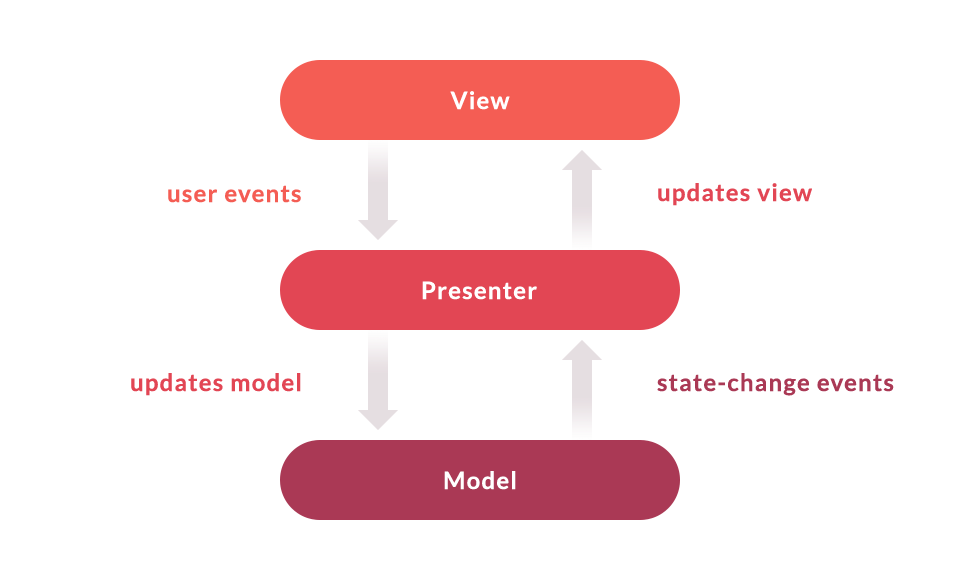

# Muzik
-  Created a react-native expo application that fetches data from itunes api

## Package Structure
```
com.muzik.in
Muzik/
├─ __test__/
│  ├─ App.test.tsx
├─ src/
│  ├─ components/
│  │  ├─ button/
│  │  │  ├─ Button.tsx
│  ├─ constants/
│  │  ├─ Color.tsx
│  ├─ navigators/
│  │  ├─ Index.tsx
│  ├─ network/
│  │  ├─ ApiCall.tsx
│  ├─ redux/
│  │  ├─ general_reducer/
│  │  ├─ Index.tsx
│  │  ├─ Store.tsx
│  ├─ Screens/
│  │  ├─ home/
│  │  │  ├─ home_redux/
│  │  │  │  ├─ home_reducer/
├─ assets/
│  ├─ images/
│  │  ├─ test.png
│  ├─ fonts/
│  │  ├─ roboto.ttf
│  ├─ Index.tsx
├─ node_modules/
│  ├─ index.css
├─ .gitignore
├─ package.json
├─ App.tsx
├─ App.json
├─ README.md
```
## Tech components
- **React-Native**
   - Code Reusability. The biggest advantage of React Native is that developers don't need to create separate codes for different platforms (Android and iOS).
- **Expo** 
  We have used Expo for 
   - To download application smoothly.
   - The Fastest Way To Build React Native Apps.
   - Publish Over The Air (OTA) Updates Instantly.
   - Integrated Access To The Native API.
   - Not All iOS And Android APIs Are Available.
   - Build's Production May Be Delayed.
- **TypeScript**
  - TypeScript Code is converted into Plain JavaScript Code: TypeScript code can’t be natively interpreted by browsers. So if the code was written in TypeScript, it gets compiled and converted into JavaScript. This process is known as Trans-piled. With the help of JavaScript code, browsers are able to read the code and display it.
   - JavaScript is TypeScript: Whatever code is written in JavaScript can be converted to TypeScript by changing the extension from .js to .ts.
   - Use TypeScript anywhere: TypeScript can be compiled to run on any browser, device, or operating system. TypeScript is not specific to any single environment.
   - TypeScript supports JS libraries: With TypeScript, developers can use already existing JavaScript code, incorporate popular JavaScript libraries, or call the TS Code from native JavaScript code.
- **Redux**
   <p align="center">
  
</p>
  - Increases the Predictability of a State. In the Redux library, a state is invariably predictable.
  - It is Highly Maintainable.
  - It Prevents Re-renders.
  - Redux Optimizes Performance.
  - Makes Debugging Easier.
  - Useful in Server-Side Rendering. 
  - Provides Ease of Testing.
  - **Unit Testing**
  - Jest Framework
  - Offers a CLI tool to control your tests easily
  - Comes with an interactive mode that automatically runs all affected tests for the code changes you’ve made in your last commit
  - Provides syntax to test a single test or skip tests with .only and .skip. This feature is useful when debugging individual 
    tests  
- **Animations**
  - The Animated (default feature of react-native) is designed to make animations fluid, powerful, and painless to build and maintain. Animated focuses on declarative relationships between inputs and outputs, configurable transforms in between, and start/stop methods to control time-based animation execution.

## Architecture
**MVP**

<p align="center">
  
</p>
 
MVP architecture pattern provides an easy way to structure the project codes. The reason why MVP is widely accepted is that it provides modularity, testability, and a more clean and maintainable codebase.
